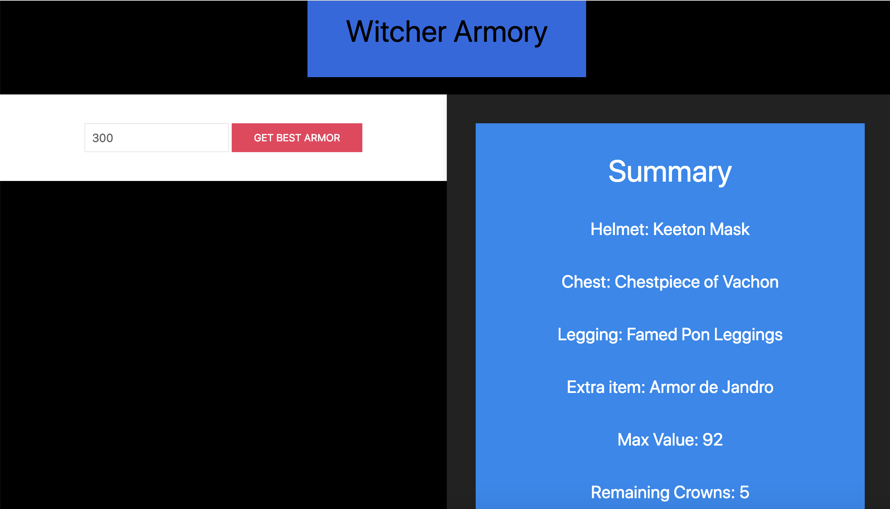
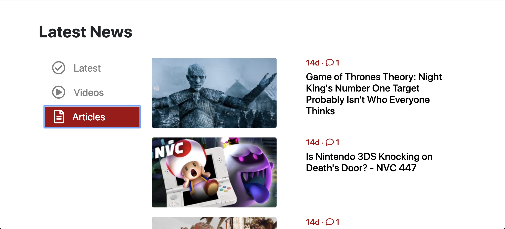
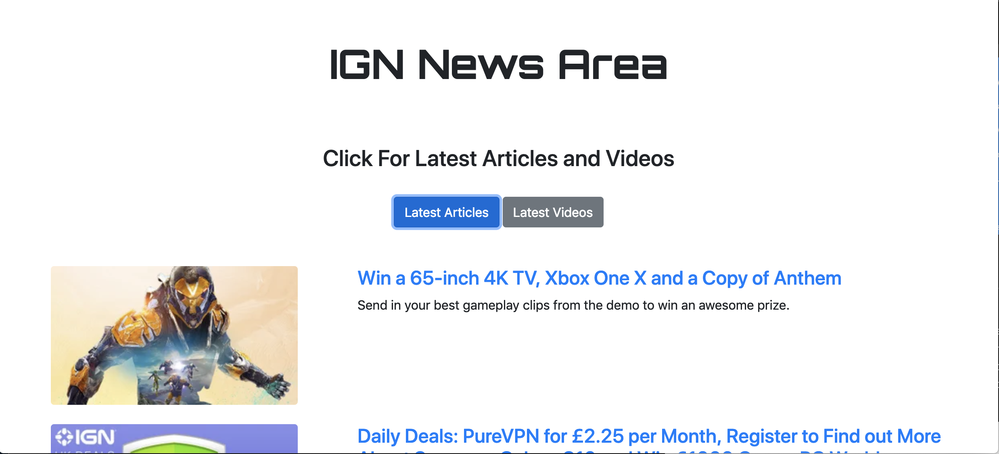

# IGN-CodeFoo

IGN CodeFoo Engineering Project for application

# Introduction
Link to Intro Page: [Introduction Page](https://mawais54013.github.io/Introduction/)

Link to Intro page Github repo: [Introduction page repo](https://github.com/mawais54013/Introduction)

# Coit Tower Pokemon Problem
PDF Solution: Click the attached PDF in the files or the following link: [Pokeball Solution](https://docs.google.com/document/d/1TDsFPf7k_78WS5TqgN6fO_99w_Ct0Z51wGGB2IP2ZmY/edit?usp=sharing)

# Witcher Problem
For this problem, I have included an HTML/CSS along with JS solution that takes an input of crowns and returns that highest possible value from the provide list. The list is organized based on the type of the item in a array of objects. There are two functions in my solution, we the first finds the max value of each chest, helmet, and legging. While the finalArmor function finds the max value of each of the categories and makes sure it's not the same as the previous three. Then, lastly we compute the total and list the items and value on the DOM. My solutions works will work with any inventory because in the end we are looking for the max of each category depending on the number of crowns, so whether each each category is organized or not, it does not matter. The only issue that might occur is that if there are two pieces of same value, most likely the program will go with the last item. Note: Comments describes each code is included. 

# Front End 

The front end portion includes a HTML, CSS, and JS files. To make my program similar to the one on the site, I used a ajax request to get information from the API, along with forEach and append to store the data on DOM in the format similar as on the site. For the structure design, I used bootstrap and all of the icons are from Font Awesome. To see it work, open the index.html in browser.

# Back End 

The back end portion, I made a schema to store in the MySQL database and import the csv file to match each storage area with data. Once the database is set, I create a server.js to make the connection with the Database and set up the API routes to get the information from the database and use in the app.js and display on the DOM. This portion requires the following npm node modules: express, mysql, path, and bodyparser. To make the application work, copy the schema into the MySQL database, please npm install to get the modules, and type node server to start the application on local host 3002. The program is very simple to pull the info from the database and display on the DOM. 
;

# Full Stack 

Recently, I created a chat application full stack project as a part of my portfolio and since it is very similar to the description, I have included it to this project set. This project uses PubNub SDK for the chat application and Twitch API for live stream. Comments and devices are stored as a part of my PubNub SDK key access and updated in real time among various users. The link to the Github repo is the following and the link to the site is included in the repo: [GameWatch Project](https://github.com/mawais54013/PubNub-Project)

# Final Notes

I had a great time creating all of my project and look forward to be a part of IGN. 

Thank you

# Author 

[Muhammad Awais](https://mawais54013.github.io/MAwais/)

[Github](https://github.com/mawais54013)

